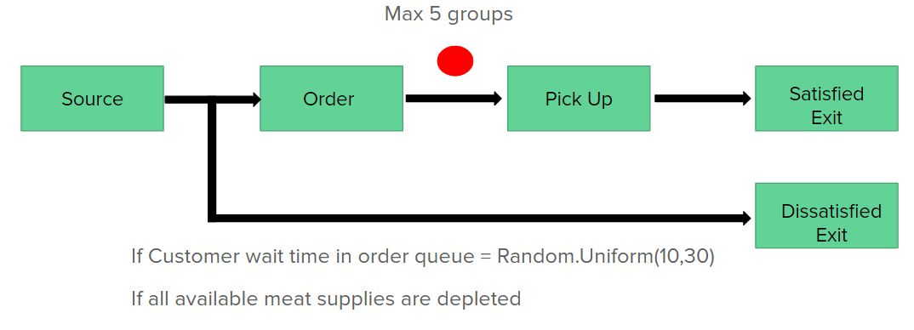
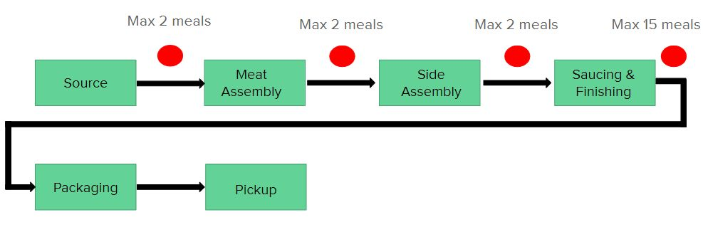
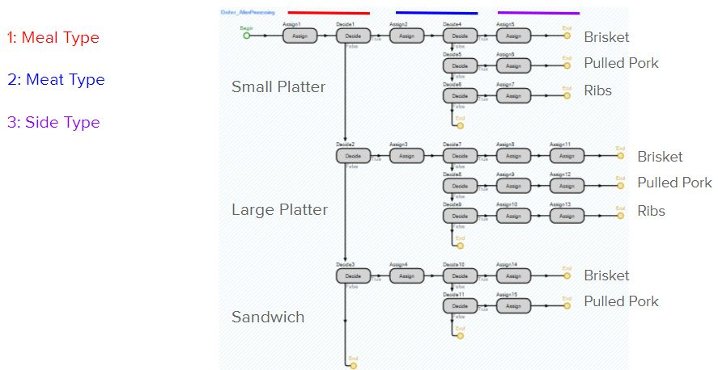

# Simio BBQ Smoke Pit: Restaurant Simulation and Optimization

**Simio Student Simulation Competition, December 2020.** Team **RITGreenSimio**, Rochester Institute of Technology. Our team was recognized as a **semi-finalist**.

**Team:** Sriparvathi Shaji Bhattathiri and Catherine Wright 
**Course:** ISEE 610 (Simulation), RIT, Fall 2020, with Dr. Michael E. Kuhl

▶️ [Watch the model presentation on YouTube](https://www.youtube.com/watch?v=aznitAY63tw)

## The problem

The Simio BBQ Smoke Pit is a barbecue restaurant that wants to change its inventory, equipment and staffing policies to make more money. We built a Simio model of how the restaurant works today and used it to find where profit was being lost.

The baseline model showed three places to improve:

| Measure (per day) | Baseline |
|---|---|
| Unrealized profit | $2,657.39 |
| Labor cost | $1,567 |
| Dissatisfied customers | 292 |

Unrealized profit was the biggest opportunity. Most of it came from customers who gave up and left because the order queue was too long. So the goal was to cut the time from order to delivery.

## The model

**Inputs from historical data**

- **Arrivals.** Customer groups arrive at a rate that changes by hour, with peaks at lunch and dinner. We modeled this with a time-varying rate table. Arrival patterns on different days of the week were statistically the same at the 90% confidence level, so one set of inputs covers every day.
- **Group size.** 1 to 6 people, drawn from a discrete distribution (for example, 34.5% singles and 45.2% pairs).
- **Orders.** Meal type (small platter, large platter or sandwich), meat (brisket, pulled pork or ribs) and side (fries, mac and cheese, greens or baked beans), each drawn from probabilities estimated from the data. The side depends only on the meal type, not on the meat.

**Customer flow.** Customers order at the counter, then wait at pickup. At most 5 groups can wait at pickup at once. When that fills, the order line grows. A customer who waits longer than a random 10 to 30 minutes, or who orders a meat that has run out, leaves and is counted as dissatisfied.

**Meal flow.** Each order creates a meal entity with the same ID as its customer. The meal passes through meat assembly, side assembly, saucing and finishing, and packaging, and is then matched back to its customer at pickup with a Combiner. Buffer logic limits each station to 2 waiting meals, so the kitchen doesn't take on more than it can handle.

**Food inventory.** State variables track how much of each meat and side is left. An add-on process at meat assembly subtracts the right amount for each order, and cooking resources restock food when it runs out.

## Optimization

We used **OptQuest** with three objectives:

1. minimize wait time in the order queue,
2. minimize customers who leave because of long waits,
3. maximize profit.

The decision variables were:

- capacity of each food-production station (meat assembly, side assembly, saucing and finishing), from 1 to 5 each, sharing 8 workstation spaces;
- number of food-production workers, from 3 to 6;
- number of customer-service workers, from 1 to 4.

We ran the **Kim–Nelson (KN)** ranking-and-selection procedure on the OptQuest candidates to pick the best scenario.

## Results

| | Recommended scenario |
|---|---|
| Station capacities (meat / side / saucing) | 3 / 3 / 2 |
| Food-production workers | 6 |
| Customer-service workers | 2 |
| Average wait in order queue | 2.2 min |
| Customers leaving due to long waits | 129, down from 292 (more than 50% fewer) |
| Daily profit | $729.10, up $158.40 |

Serving more customers raised revenue, but most of the gain went to the extra labor. We recommended a follow-up study that varies staffing by time of day, with more people at lunch and dinner and fewer during slow hours, to keep service levels while cutting labor cost.

## Repository contents

| Path | What it is |
|---|---|
| `figures/` | Model flow diagrams from our executive summary |

The Simio model file (`.spfx`) is kept in a private repository, because the competition problem and data belong to Simio. It's available on request for reviewers or collaborators.

## Authors

Sriparvathi Shaji Bhattathiri and Catherine Wright, Rochester Institute of Technology. Shared here with my teammate's permission.
